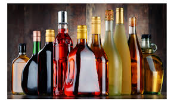
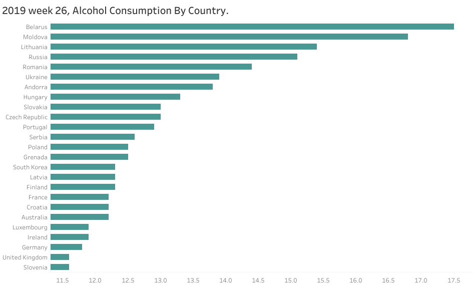

# Alcohol Consumption By Country

## Overview

The problem of alcohol misuse has affected billions of people. Alcoholism is a disease that is characterized by a reliance on alcohol, 
where a person is motivated by a desire or physical need to drink. It is also known as an alcohol use disorder (AUD) or an alcohol addiction.

## Objective

Which country has the highest and the lowest consumption of alcohol in the world.

## About Data

Data was was sourced from [world atlas](https://www.worldatlas.com/society/top-10-alcohol-consuming-countries-in-the-world.html) into excel format.

## Data Transformation

Data was processed and cleaned using excel before uploading into [tableau](https://public.tableau.com/app/profile/michael.martins7611/viz/2019week26AlcoholConsumptionByCountry/Dashboard1) for visualization.

## Data Validation.

Data validation was applied accordingly.

## Findings

Belarus has the highest liters of pure alcohol consumption per capita.

While United Kingdom and Slovenia has the lowest liters of pure alcohol consumption per capita.

## Project Summary

.png)

Knowing that alcohol, like other beverages including soft drinks, juices, tea, cocoa, and coffee, plays a significant role in many communities. Depending on how responsibly it is drunk, alcohol can have either negative or positive consequences. More research is needed to definitively determine the impact of a high per capita alcohol consumption on a nation, and these patterns are probably not reason for concern.